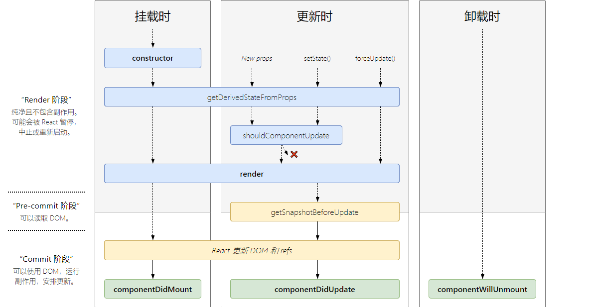

## react生命周期(v16.4)

 - 组件的挂载(Mounting)阶段
   -  constructor()用来做一些组件的初始化工作，如定义this.state的初始内容。
   -  getDerivedStateFromProps()
   -  render()
      render是纯函数,不能在里面执行this.setState，会有改变组件状态的副作用。
   -  componentDidMount()
      -----------componentWillMount()即将过时

- 组件的更新(update)阶段
    -  父组件重新render致更新
       -   父组件重新render导致的**重传**props，无论props有没有变化这可以通过shouldComponentUpdate(nextProps,nextState)优化。
       -   props变化。
    -  组件本身调用setState致更新

  updation分为：
    -  getDerivedStateFromProps()
    -  shouldComponentUpdate(nextProps, nextState)
       返回false则当前组件更新停止，可用于优化组件性能。
    -  render()
    -  getSnapshotBeforeUpdate()
    -  componentDidUpdate(prevProps, prevState)
       -----------componentWillUpdate(nextProps, nextState)、componentWillReceiveProps()即将过时
- 卸载(Unmounting)阶段
    -  componentWillUnmount()
       在组件被卸载前调用，可以在这里执行一些清理工作，比如清除组件中使用的定时器，清除componentDidMount中手动创建的DOM元素等，以避免引起内存泄漏。
- 错误处理
   当渲染过程，生命周期，或子组件的构造函数中抛出错误时，会调用如下方法：
    - static getDerivedStateFromError()
    - componentDidCatch()

